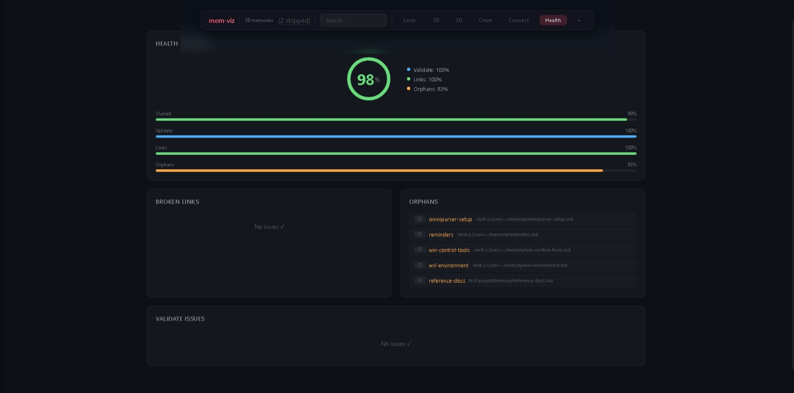
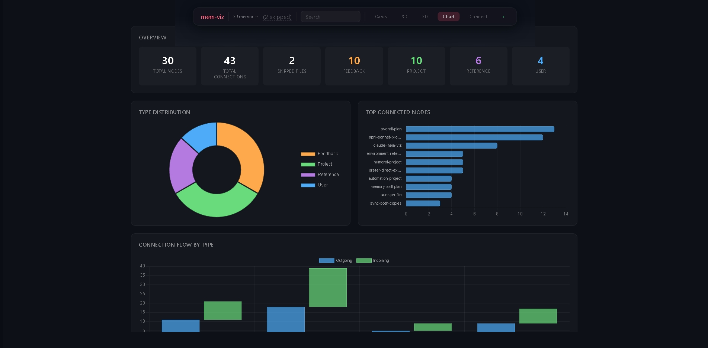
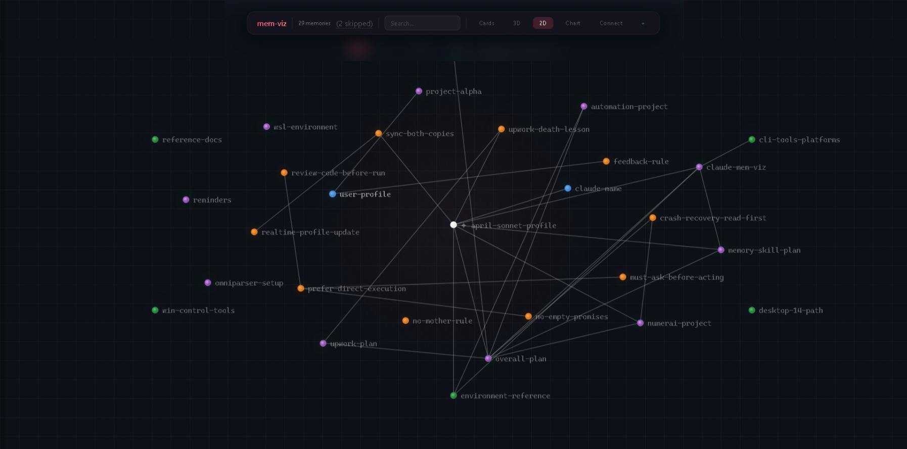
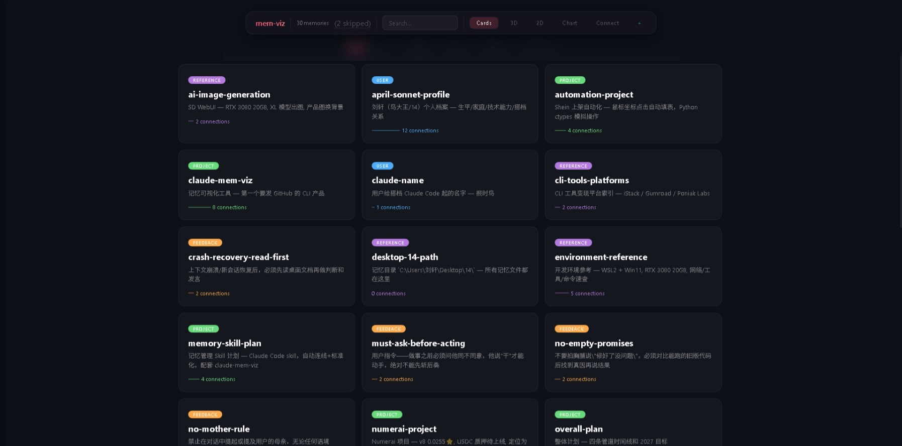
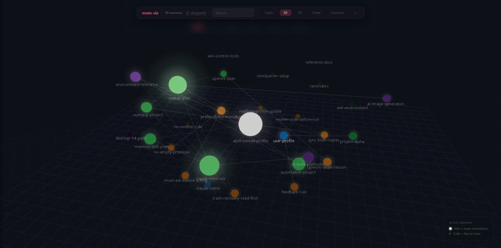

# claude-mem-viz

Visualize Claude Code's memory files in 3D, 2D, and more. Scans `~/.claude/projects/*/memory/*.md`, parses YAML frontmatter and `[[wiki-links]]`, then renders an interactive knowledge graph.


*Charts — type distribution, connection stats, word cloud*


*Health panel — real-time data quality scores, broken links, and orphans*


*2D view — directed arrows show citation directions, drag to rearrange*


*Card view — default interface, all memory files in a clean grid*


*3D view — nodes glow brighter with more connections*

## Features

- **Five views** — Cards / 3D heatmap / 2D directed graph / Chart dashboard / Health panel
- **SSE live reload** — auto-redraws when memory files change
- **Auto-detect primary project** — picks the one with the most `.md` files
- **[[wiki-link]] parsing** — builds edges from `[[references]]` in file bodies
- **Health checks** — validate / check-links / find-orphans, with AI-powered auto-fix
- **CRUD editing** — edit memory files directly from the browser, with automatic backups
- **Zero dependencies** — pure Node.js stdlib, no `npm install` needed

## Quick Start

```bash
git clone https://github.com/<your-username>/claude-mem-viz.git
cd claude-mem-viz

# Start (scans ~/.claude/projects/ by default)
node server.js

# Custom directory
node server.js --dir /your/claude/projects
```

Open `http://localhost:3457` in your browser.

## CLI Options

| Flag | Default | Description |
|------|---------|-------------|
| `--dir` | `~/.claude/projects` | Root directory of Claude Code projects |
| `--port` | `3457` | HTTP server port |

## How It Works

```
~/.claude/projects/
├── project-a/memory/
│   ├── MEMORY.md          ← index file
│   ├── my-project.md      ← frontmatter: type: project
│   └── my-profile.md      ← frontmatter: type: user (with [[wiki-links]])
└── project-b/memory/
    └── ...
```

Each `.md` file must have YAML frontmatter:

```markdown
---
name: my-project
description: "Short description"
metadata:
  type: project   # project | user | reference | feedback
---

Body... 关联: [[other-file]] [[another-file]]
```

`server.js` will:
1. Recursively scan all `memory/` directories
2. Parse frontmatter for `name` / `type`
3. Extract `[[wiki-links]]` from the body to build edges
4. Push data to the frontend via SSE

## Health Checks

```bash
npm run health
```

Four scores:
- **Validate** — frontmatter integrity (name/description/type)
- **Links** — broken `[[wiki-link]]` detection (code-span links auto-skipped)
- **Orphans** — nodes with zero connections (10% baseline tolerance, `standalone: true` exempts)
- **Overall** — weighted average

Individual checks:
```bash
npm run validate    # frontmatter integrity
npm run check-links # broken links
npm run find-orphans # orphan nodes
```

## Installation (global CLI)

```bash
npm install -g .
memory    # ← launches the viz server from anywhere
```

## Claude Code Skills

This repo includes two optional skills for [Claude Code](https://claude.ai):

### memory-management (recommended)
Auto-enforces memory file quality:
- Enforces frontmatter template on new files
- Auto-detects `[[wiki-links]]` on create/update
- Maintains `MEMORY.md` index
- Triggers health checks after 3+ file changes
- AI-fixes broken links, orphans, and formatting

### memory-optimize (on-demand)
AI-driven optimization layer:
- Suggests missing `[[wiki-links]]`
- Auto-writes descriptions
- Flags stale/outdated files
- Recommends merge candidates

### Install

```bash
cp -r skills/* ~/.claude/skills/
```

Skills activate automatically on next Claude Code session — no manual trigger needed.

## Project Structure

```
claude-mem-viz/
├── server.js            # HTTP + SSE + file scanner + CRUD + backup
├── package.json
├── public/
│   ├── index.html       # HTML skeleton
│   ├── style.css        # Styles
│   └── app.js           # Frontend logic (five views)
├── scripts/
│   ├── validate.js      # Frontmatter validation
│   ├── check-links.js   # Broken link detection
│   ├── find-orphans.js  # Orphan node detection
│   └── health-report.js # Aggregated health score
├── skills/
│   ├── memory-management/  # Recommended Claude Code skill
│   └── memory-optimize/    # On-demand optimization skill
└── screenshots/         # Interface screenshots
```

## License

MIT
